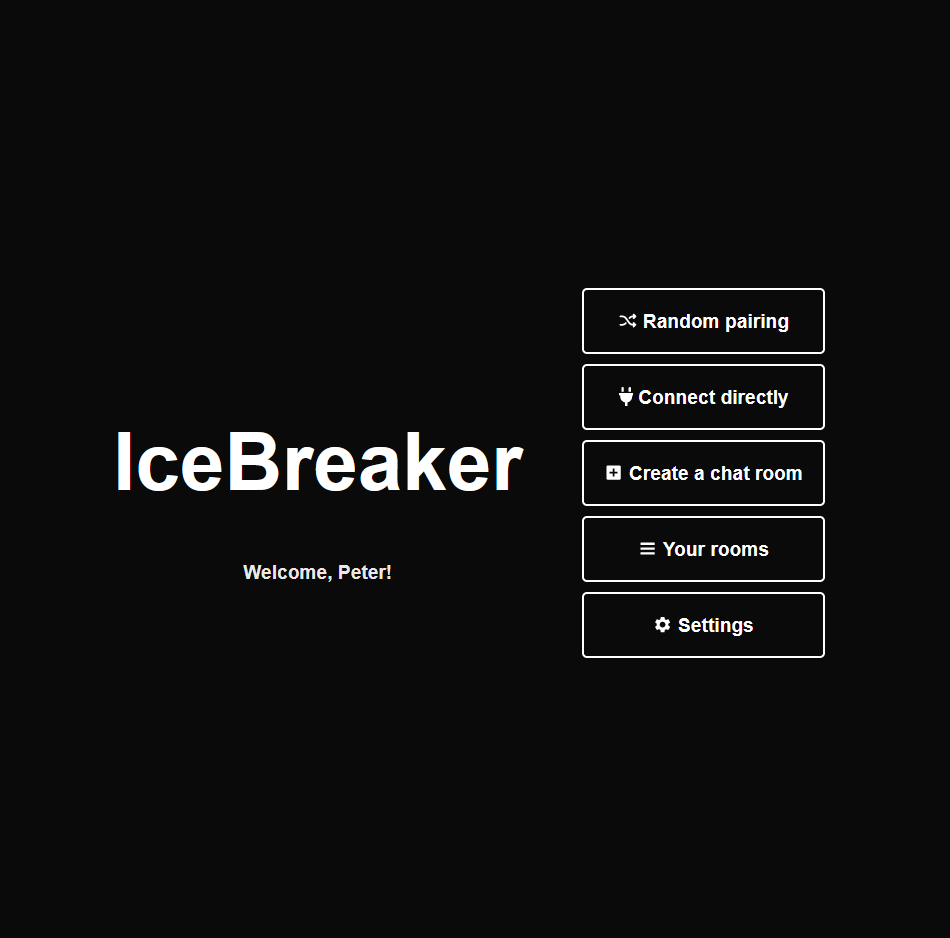
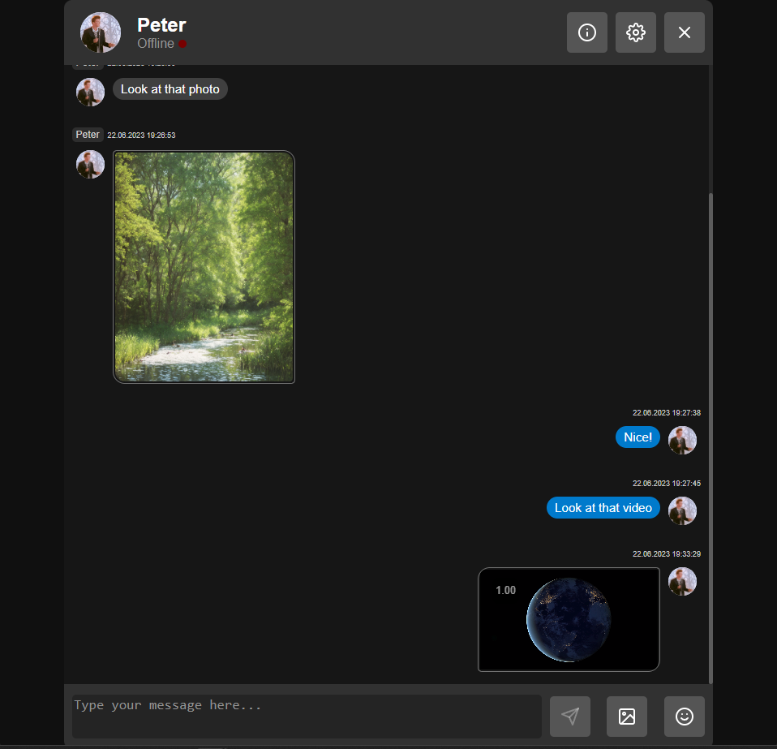

# IceBreaker

IceBreaker is a Python-built Flask web chat application that enables users to create chat rooms and establish direct conversations with other users. It also supports random user pairing based on specific criteria.

## Features

The main features of the application include:

* Chat room creation
* Direct user connection
* Random user pairing
* Text, image, and video message transmission
* User and room settings customization

## Screenshot

*Fig. 1. Homepage*

*Fig. 2. Chat screen*

## Technologies

* Backend: Python, Flask
* Real-time communication: Flask-SocketIO
* Database: SQLite with Flask-SQLAlchemy
* Form Handling: Flask-WTF
* Browser-based message storage: IndexedDB
* Video handling: video.js

## Installation and Running

1. Clone the repository `git clone https://github.com/KozaCode/IceBreaker.git`
2. Run `setup.bat` to install the virtual environment.
3. Run `run.ba`t to start the server.
4. Open the app in your browser: `http://localhost:5000`

## Future of the Project

The development of IceBreaker is ongoing, with plans for introducing additional features such as:

* Room leaving functionality
* Chat notifications about who joined or left the room
* Notifications about changes in room settings
* User privileges management
* Message deletion and clearing
* User avatar customization
* end-to-end encryption

## Contributions

All proposals for improvements, bug reports, and new features are welcome. Please open an issue or send a pull request.

## License

This application licensed under the terms of the [Apache License, Version 2.0][Apache License, Version 2.0]. [Apache License, Version 2.0]: [http://www.apache.org/licenses/LICENSE-2.0.html](http://www.apache.org/licenses/LICENSE-2.0.html)
